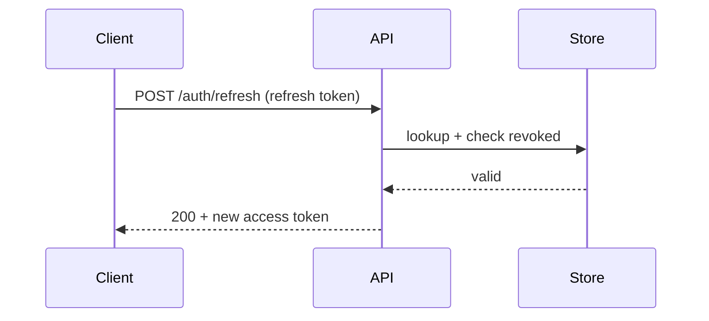

# Write Spec

Produce a specification as one markdown file. The goal is a document that stays correct as code, models, and tooling change, because the behavior it describes is anchored to assertions a machine can check, not to prose a reader has to interpret. Prose carries the *why* (intent, rationale, context) for the humans who read it; the assertions carry the *what* (behavior) for whoever implements and verifies it.

Your job is to write that document. Apply the principles below; do not lecture the reader about them or name them in the output - the spec should simply embody them.

## Principles to apply

1. **Prose for intent, assertions for behavior.** Use sentences only for the things a human needs to understand and can't get from a test: the problem, the goal, the rationale, the boundaries, who this is for. Never describe required behavior in loose prose that someone later has to re-interpret. Behavior goes in assertions.

2. **Every behavioral requirement is one checkable assertion.** Write each as a Boolean statement that is true or false for a given run, in the shape *precondition -> action -> observable postcondition* (Given / When / Then). No "it depends", no "should generally", no unmeasurable adjectives ("fast", "robust", "intuitive") unless bound to a concrete threshold (`p95 < 200ms`, `returns within 3 retries`).

3. **Pin each assertion to a verification.** Name exactly how it is checked: a test, a command, an HTTP call with an expected status, an assertion that returns pass/fail. If you cannot state how it would be checked, it is not yet specified, mark it `draft` and move it to Open Questions rather than dressing it up as settled.

4. **Pick the smallest shape that captures the requirement:**
   - an **example** - one concrete input and its exact expected output (`get_token_status(expired) == 401`),
   - a **property** - a statement true for every input of a class ("for any sorted list, the result of `search` is a correct index or `not-found`"),
   - a **contract** - precondition + postcondition + invariant for an operation or data type.
   Prefer an example when one case nails it; use a property when the rule is universal; use a contract when an operation has state, preconditions, or an invariant that must always hold.

5. **Give every requirement a lifecycle status:** `draft` (still being decided), `specified` (precise, unambiguous, and has a named verification, but not yet built/passing), `verified` (the check exists and currently passes). New specs are mostly `draft`/`specified`. Surface the status on every item so progress is visible at a glance.

6. **Small, single-purpose diagrams.** Each mermaid block illustrates exactly one thing: one flow, one state machine, one set of relationships. Keep them to a handful of nodes. A diagram that tries to show the whole system communicates nothing - split it or drop it. Add a diagram only where spatial or temporal structure is genuinely clearer than a sentence.

7. **Scope is falsifiable.** State what is in scope and, explicitly, what is *not* (non-goals). A boundary you can't point at later isn't a boundary.

8. **Short beats long.** Precision, not volume. A tight page of checkable assertions is worth more than six pages of prose, and is far less likely to be misread. Cut anything that doesn't either explain intent or pin behavior.

## Workflow

1. **Clarify intent and scope.** If the request is thin, ask a few targeted questions before writing: what exactly is being built, what problem it solves, who reads the spec and who consumes the behavior, and what is explicitly out of scope. Don't invent answers to fill gaps - unknowns become Open Questions.
2. **Decompose into behaviors.** Break the feature into the smallest independent behaviors. For each, write the assertion in the smallest shape (example / property / contract), assign an ID, a status, and a verification.
3. **Add data and state contracts.** Where the change touches a schema, model, or state machine, capture preconditions, postconditions, and invariants. These are assertions too.
4. **Draw only the diagrams that earn their place.** One small mermaid block per distinct flow / state machine / relationship. Skip diagrams that just restate a sentence.
5. **List genuine unknowns** under Open Questions, each marked `draft`. Never guess a decision the user hasn't made.
6. **Write the file.** Save to the path the user gives; if none, propose `docs/specs/<slug>.md` (respecting any file-placement conventions in `.deployed-agents/conventions.md`) and confirm. Then report the path and a one-line summary of how many behaviors are `specified` vs still `draft`.

## Document structure

Use this layout. Drop any section that would be empty rather than padding it.

```markdown
# <Thing being specified> - Specification

> Status: <draft | specified | verified overall>  ·  Owner: <who>  ·  Updated: <date>

## Intent
<2-4 sentences: the problem, the goal, and why it matters. Plain language for a
reader who is new to this. No required behavior here - just the why.>

## Scope
**In scope:** <bullet list of what this spec covers>
**Non-goals:** <explicit, falsifiable list of what it deliberately does not cover>

## Context
<Optional: one small mermaid diagram placing this in its surroundings - the
handful of components or actors it talks to. Only if it clarifies.>

## Behavior
Each requirement is one checkable assertion. ID, status, and a way to verify.

### B1 `specified` - <short name>
- **Given** <precondition>
- **When** <action / input>
- **Then** <observable, Boolean postcondition>
- **Verify:** `<command, test name, or request -> expected result>`

### B2 `draft` - <short name>
- **Property:** for all <input class>, <invariant that must hold>
- **Verify:** `<property test / how it's checked>`

(repeat per behavior; keep each one atomic)

## Data & invariants
<Contracts for any schema/model/state involved: required fields, value
constraints, and invariants that must always hold. Optional small ER or class
mermaid diagram for relationships, or a state diagram for a lifecycle.>

## Flows
<Optional small sequence/flow diagrams, one per distinct interaction. A few
participants each.>

## Open Questions
<Genuinely undecided points, each marked `draft`. These block nothing from being
written down, but they are not yet `specified`. Never resolve these by guessing.>
```

## Status summary table (optional, for larger specs)

When there are more than a handful of behaviors, put a compact table near the top so the lifecycle is visible at a glance:

```markdown
| ID | Behavior | Status | Verify |
|----|----------|--------|--------|
| B1 | Expired token rejected | specified | `GET /auth/refresh` (expired) -> `401` |
| B2 | Refresh rotates token | draft | (open: rotation policy undecided) |
```

## Diagram guidance

Match the diagram to the situation, and keep each one small and single-purpose:

- **sequence** - a request/response or message exchange between 2-4 participants.
- **stateDiagram-v2** - a lifecycle or state machine with a few states and the transitions between them.
- **erDiagram** - relationships between 2-3 entities for a schema change.
- **classDiagram** - a new data model or type with its key fields.
- **flowchart** - control flow that branches non-trivially (a decision with a couple of outcomes).
- **UI: screens, forms, dialogs, component layouts** (PlantUML) - a wireframe of one screen or component, written as a fenced code block tagged `plantuml` whose body runs from `@startsalt` to `@endsalt`. Mermaid has no UI/wireframe primitive, so every UI mockup goes in PlantUML.

If a diagram needs a legend to be understood, or has more than ~7 nodes, it is doing too much: split it into smaller ones or replace it with assertions.

## Worked example (shape to aim for)

````markdown
# Token Refresh Endpoint - Specification

> Status: specified  ·  Owner: auth team  ·  Updated: 2026-06-05

## Intent
Clients hold short-lived access tokens and must refresh them without re-login.
This endpoint trades a valid refresh token for a new access token. It exists so
sessions survive access-token expiry without weakening revocation.

## Scope
**In scope:** the `POST /auth/refresh` endpoint and its success/failure outcomes.
**Non-goals:** login, logout, token storage on the client, refresh-token rotation
policy (tracked separately).

## Behavior

### B1 `specified` - Expired access token is rejected
- **Given** a request whose access token has expired
- **When** it calls any protected endpoint
- **Then** the response status is exactly `401`
- **Verify:** `assert get_token_status(expired_token) == 401`

### B2 `specified` - Valid refresh token yields a new access token
- **Given** an unexpired, unrevoked refresh token
- **When** `POST /auth/refresh` is called with it
- **Then** the response is `200` with a new access token whose expiry is in the future
- **Verify:** `test_refresh_returns_fresh_token` (asserts status 200 and `exp > now`)

### B3 `specified` - Revoked refresh token is rejected
- **Given** a refresh token that has been revoked
- **When** `POST /auth/refresh` is called with it
- **Then** the response status is `401` and no token is issued
- **Verify:** `POST /auth/refresh` (revoked) -> `401`, body has no `access_token`

## Flows


## Open Questions
- `draft` Should a successful refresh also rotate the refresh token? Decision pending.
````

## What not to do

- Don't describe behavior in prose paragraphs - that is the failure mode this command exists to avoid. If it's behavior, it's an assertion with a verification.
- Don't write a requirement you can't say how to check. Mark it `draft` and put it in Open Questions.
- Don't use unmeasurable words ("fast", "secure", "user-friendly") as requirements. Bind them to a threshold or drop them.
- Don't draw one big diagram of everything. Many small ones, or none.
- Don't pad. Cut every line that neither explains intent nor pins behavior.
- Don't invent decisions to make the spec look complete. Unknowns stay visible.
