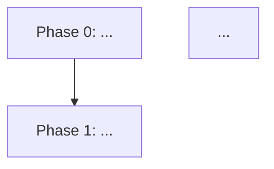

# /review-and-fix

Create or repair the implementation plan at `{{plan_path}}` so it complies with what the implementer (`/implement-phase`) and reviewer (`/review-implementation`) agents expect.

This command operates in two modes — it picks the mode automatically:

- **Create mode** — when no plan file exists at `{{plan_path}}`, or when invoked with `new` / `create` / `--new`.
- **Audit + auto-fix mode** — when a plan file exists. The default.

## What is "the canonical structure"?

The implementer and reviewer expect the following layout. Sections are at level 2 (`##`) unless noted.

```
# <Project Name> Implementation Plan

<one-paragraph summary of what is being built and why>

## Phase Flow


## Recommended Execution Order
1. Phase 0 — <title>
2. Phase 1 — <title>
...

## Automation Contract
- <one-paragraph or bulleted list of what implementers can assume about build, test, CI, environment, secrets, etc.>

## Definition of Done
- <exit criteria for the WHOLE plan, not per-phase>

## Phase N: <Title>
<optional design narrative>

### Work
- <task 1>
- <task 2>

### Acceptance Criteria
- <criterion 1>
- <criterion 2>

(repeat per phase)

## Files to Create by Phase
### Phase 0
- `path/to/file1`
- `path/to/file2`
### Phase 1
- `path/to/file3`
(repeat per phase)

## Test Plan
### Phase 0
- <test description>
### Phase 1
- <test description>
(repeat per phase)

## Open Questions
1. **<label>.** <question>
(append-only — existing entries are owned by the user)

## Residual Risks
- <risk 1>
- <risk 2>
```

Status markers (`✅`, `⚠️`, `⚠`) on phase headings, `### Work` bullets, and `### Acceptance Criteria` bullets are written by `/review-implementation` over time. **This command never adds, edits, or removes status markers.**

## Auto-fix mode (default when plan exists)

### 1. Read the plan

Open `{{plan_path}}` and parse the top-level sections (`#`, `##`, `###` headings) into a map.

### 2. Audit

Check for each of the following. A finding is **STRUCTURAL** when the implementer/reviewer can't function correctly without it, and **STYLE** when it's only a formatting/consistency issue.

| Check | Severity | Notes |
|-------|----------|-------|
| `# <Title>` heading at top | STRUCTURAL | Required for the plan to identify itself. |
| `## Phase Flow` with a mermaid block | STRUCTURAL | Reviewer marks nodes in this graph. |
| `## Recommended Execution Order` numbered list | STRUCTURAL | Reviewer marks entries. |
| `## Automation Contract` | STRUCTURAL | Implementer reads this for build/test assumptions. |
| `## Definition of Done` | STRUCTURAL | Reviewer uses this as the overall exit gate. |
| At least one `## Phase N: <Title>` heading | STRUCTURAL | Plan is useless without phases. |
| Every phase has `### Work` block with at least one bullet | STRUCTURAL | Implementer reads this. |
| Every phase has `### Acceptance Criteria` block with at least one bullet | STRUCTURAL | Reviewer reads this. |
| `## Files to Create by Phase` with a `### Phase N` sub-block for each phase | STRUCTURAL | Reviewer checks promised files exist. |
| `## Test Plan` with a `### Phase N` sub-block for each phase | STRUCTURAL | Reviewer checks test coverage. |
| `## Open Questions` numbered list | STRUCTURAL | Reviewer appends to this. |
| `## Residual Risks` bulleted list | STRUCTURAL | Reviewer adds/removes/reword entries. |
| Phase headings in the form `## Phase N: <Title>` (colon, not dash) | STYLE | Both forms work, but canonical is colon. |
| Phase numbering is contiguous (0, 1, 2, … no gaps) | STYLE | Gaps confuse readers but don't break the agents. |
| Sections appear in the canonical order shown above | STYLE | Out-of-order sections work but read awkwardly. |

### 3. Auto-fix structural issues

For every STRUCTURAL finding, write the missing section into the plan **without touching existing content**:

- **Missing `## Phase Flow`**: insert below the title summary with a placeholder mermaid block that lists every existing phase heading as a node:
  ```mermaid
  flowchart TD
      P0[Phase 0: <title>] --> P1[Phase 1: <title>]
      P1 --> P2[Phase 2: <title>]
  ```
  The user can wire the edges however they want; the section just needs to exist for the reviewer to mark.

- **Missing `## Recommended Execution Order`**: insert a numbered list with one entry per existing phase, in ascending number order. Format: `1. Phase 0 — <title>`.

- **Missing `## Automation Contract`**: insert with a placeholder bullet: `- (Document build/test/CI/environment assumptions here. The implementer reads this before starting.)` — the user fills in the real content.

- **Missing `## Definition of Done`**: insert with a placeholder bullet: `- (List the exit criteria for the whole plan. The reviewer uses this as the overall completion gate.)` — the user fills in the real content.

- **Phase missing `### Work` block**: insert an empty `### Work` sub-heading directly under the phase heading with a placeholder bullet: `- (List work items for this phase.)`.

- **Phase missing `### Acceptance Criteria` block**: insert an empty `### Acceptance Criteria` sub-heading after the `### Work` block with a placeholder bullet: `- (List acceptance criteria for this phase.)`.

- **Missing `## Files to Create by Phase`**: insert with `### Phase N` sub-blocks for every existing phase, each containing a placeholder bullet: `- (List files this phase creates.)`.

- **Missing `## Test Plan`**: insert with `### Phase N` sub-blocks for every existing phase, each containing a placeholder bullet: `- (List tests this phase ships or unblocks.)`.

- **Missing `## Open Questions`**: insert with the heading and an empty numbered list (no placeholder content — the section starts empty and is appended to over time).

- **Missing `## Residual Risks`**: insert with the heading and an empty bulleted list.

- **Missing `### Phase N` sub-block under `## Files to Create by Phase` or `## Test Plan`**: insert with the placeholder bullet shown above for that phase number.

### 4. Do NOT touch

- Content of any `### Work`, `### Acceptance Criteria`, `## Definition of Done`, `## Automation Contract`, or `## Residual Risks` entries that already have non-placeholder content.
- Existing `## Open Questions` entries — that section is append-only and owned by the user.
- Status markers (`✅`, `⚠️`, `⚠`) on phase headings, work bullets, or acceptance-criteria bullets.
- Checklist syntax (`- [ ]` / `- [x]`) in `### Work` blocks.
- Design narrative paragraphs within phase sections.
- Custom user-added sections that don't conflict with the canonical names.

### 5. Style-pass (optional, only when no other diff is pending)

If the plan was already STRUCTURAL-clean, also apply STYLE fixes:

- Normalize phase headings to `## Phase N: <Title>` form.
- If two or more phases share the same number, leave it alone and surface a finding to the user (don't guess at the renumbering).
- Reorder sections to the canonical order **only if doing so doesn't move any phase out of the body of the plan**. Reordering moves whole sections; it does not merge or split them.

### 6. Report

Summarize what was changed. Format:

```
Plan audited: {{plan_path}}

Structural fixes applied:
  - Added ## Definition of Done (placeholder content)
  - Added ### Work block under Phase 3
  - Added ### Phase 2 under ## Files to Create by Phase (placeholder content)

Style fixes applied:
  - (none)

Style findings NOT auto-fixed (user discretion):
  - Phase 4 and Phase 5 are both numbered "5"

The plan now matches the canonical structure expected by /implement-phase and /review-implementation. Placeholder bullets are marked with parentheses — fill them in before running the implementer.
```

## Create mode

### 1. Confirm there's nothing to overwrite

If `{{plan_path}}` already exists, switch to audit + auto-fix mode instead. Never silently overwrite an existing plan.

### 2. Gather inputs

Ask the user (in a single bundled question if possible — Cowork's AskUserQuestion tool, or otherwise inline):

- A one-paragraph summary of what's being built and why.
- A rough list of phase titles (numbered from 0 or 1). The user may say "I don't know yet — propose some" — in that case, propose 3-5 plausible phases based on the project name and stack from `AGENTS.md`, then ask for sign-off.

Do NOT ask the user to fill in `### Work`, `### Acceptance Criteria`, `## Files to Create by Phase`, `## Test Plan`, `## Definition of Done`, or `## Automation Contract` content interactively — those go in as placeholders that the user fills in afterwards. The goal of create mode is to lay down a compliant skeleton, not to extract a detailed plan from the user in one shot.

### 3. Generate the plan file

Write `{{plan_path}}` with the canonical structure described at the top of this document. Fill in:

- `# <Title>` — `<Project Name> Implementation Plan`.
- Summary paragraph — verbatim from the user's input.
- `## Phase Flow` — mermaid flowchart with one node per phase in linear order (P0 → P1 → P2 → …).
- `## Recommended Execution Order` — numbered list of phase titles.
- Every phase heading, `### Work` block, `### Acceptance Criteria` block, `### Phase N` sub-blocks under `## Files to Create by Phase` and `## Test Plan` — populated with the placeholder bullets shown in the auto-fix section.
- `## Definition of Done`, `## Automation Contract` — placeholder bullets.
- `## Open Questions`, `## Residual Risks` — empty.

### 4. Report

Show the user the generated plan path and tell them what to fill in:

```
Created {{plan_path}} with N phases and the canonical structure.

Before running /implement-phase you should fill in:
  - ## Automation Contract (build/test/CI assumptions)
  - ## Definition of Done (overall exit criteria)
  - For each phase: ### Work, ### Acceptance Criteria, file list, test list
```

## Things you do NOT do

- Do not change the content of any non-placeholder bullet.
- Do not touch status markers or checklist boxes.
- Do not edit or remove `## Open Questions` entries.
- Do not rename phases. (Renumbering or retitling phases is the user's call.)
- Do not delete sections, even ones that don't belong in the canonical list — they may be user-specific additions.
- Do not commit. The user reviews and commits.
