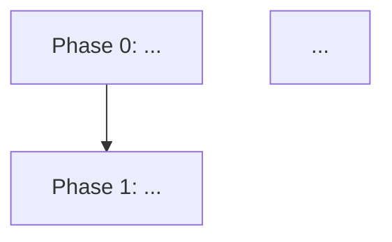

# /review-and-fix

Create or repair the implementation plan at `{{plan_path}}` so it complies with what the implementer (`/implement-phase`) and reviewer (`/review-implementation`) agents expect.

The audit covers **both the structure and the content** of the plan. It auto-fixes missing structural sections, and it reviews the substance of the sections that already exist – surfacing unfilled placeholders, vague or non-verifiable items, and internal inconsistencies as advisory findings. Content review is report-only: the command flags content gaps but never rewrites your prose.

This command operates in two modes – it picks the mode automatically:

- **Create mode** – when no plan file exists at `{{plan_path}}`, or when invoked with `new` / `create` / `--new`.
- **Audit + auto-fix mode** – when a plan file exists. The default.

## What is "the canonical structure"?

The implementer and reviewer expect the following layout. Sections are at level 2 (`##`) unless noted.

```
# <Project Name> Implementation Plan

<one-paragraph summary of what is being built and why>

## Phase Flow


## Recommended Execution Order
1. Phase 0 – <title>
2. Phase 1 – <title>
...

## Automation Contract
- <one-paragraph or bulleted list of what implementers can assume about build, test, CI, environment, secrets, etc.>

## Definition of Done
- <exit criteria for the WHOLE plan, not per-phase>

## Phase N: <Title>
<optional design narrative; embed Mermaid sequence/class/ER/state/flowchart blocks here where they clarify the design – see "Diagrams" below>

### Work
- [w1] <task 1>
- [w2] <task 2>

### Acceptance Criteria
- [a1] <criterion 1>
- [a2] <criterion 2>

(repeat per phase)

## Files to Create or Modify by Phase
### Phase 0
- [f1] `path/to/file1`
- [f2] `path/to/file2`
### Phase 1
- [f1] `path/to/file3`
(repeat per phase; list files the phase creates or modifies; IDs restart per phase)

## Test Plan
### Phase 0
- <test description>
### Phase 1
- <test description>
(repeat per phase)

## Decisions
<Free-form notes on decisions the user made, confirmed, ratified, or revised during design or implementation. This is a live section: the user and `/review-implementation` may freely add, edit, restructure, or remove entries as decisions evolve. Not append-only and not a fixed numbered list. May be empty or note there are none.>

## Open Questions
1. **<label>.** <question>
(append-only – existing entries are owned by the user; empty, or a note such as `None.` / `No open questions.`, is acceptable)

## Residual Risks
- <risk 1>
- <risk 2>
```

Status markers (`✅`, `⚠️`, `⚠`) on phase headings, `### Work` bullets, and `### Acceptance Criteria` bullets are written by `/review-implementation` over time. **This command never adds, edits, or removes status markers.**

### Stable item IDs

Every `### Work`, `### Acceptance Criteria`, and per-phase Files bullet carries an ID in square brackets directly after the leading `-`: `[w1]`, `[w2]`, … for Work; `[a1]`, `[a2]`, … for Acceptance; `[f1]`, `[f2]`, … for Files. IDs restart at `1` per phase and per kind. These keys the implementer's `progress.json` overlay against; without them the renderer falls back to bullet index and loses track when bullets reorder. This command emits them in new plans and adds them on repair where missing.

### Lifecycle surfaces (reviewer-owned, optional)

The Plan Contract supports any one of these to mark a phase's lifecycle (`pending` / `current` / `under-review` / `needs-fixes` / `completed`):

- A `## Phase Status` table near the top: `| Phase 0 | completed | … |`.
- A `Status:` line immediately under the phase heading.
- Mermaid `class P0 done` (or `current`/`pending`/…) inside the `## Phase Flow` block, with matching `classDef` declarations.

These are additive to the existing `✅`/`⚠️` heading markers; the reviewer writes them. This command never touches them, but does ensure the Phase Flow `classDef` block exists if the plan uses Mermaid classes.

### Diagrams in phase narratives

When generating or repairing a phase, lean into Mermaid diagrams in the design narrative (between the phase heading and `### Work`) where they clarify the design better than prose. Use the right diagram for the situation:

- **Sequence diagrams** for request/response flows, agent interactions, message handoffs.
- **Class diagrams** for new data models, object relationships, type hierarchies.
- **ER diagrams** for database schema changes.
- **State diagrams** for state machines, lifecycle transitions.
- **Flowcharts** for control flow that branches non-trivially.

The renderer extracts these from phase prose and turns them into proper visuals. Diagrams are optional, never required – but planning agents should propose one whenever spatial structure beats sequential prose.

## Auto-fix mode (default when plan exists)

### 1. Read the plan

Open `{{plan_path}}` and parse the top-level sections (`#`, `##`, `###` headings) into a map.

### 2. Audit

Check for each of the following. A finding is **STRUCTURAL** when a section is missing or malformed so the implementer/reviewer can't function, **CONTENT** when a section is present but its substance is missing, still a placeholder, vague, or internally inconsistent, and **STYLE** when it's only a formatting/consistency issue.

#### Structural & style checks

| Check | Severity | Notes |
|-------|----------|-------|
| `# <Title>` heading at top | STRUCTURAL | Required for the plan to identify itself. |
| `## Phase Flow` with a mermaid block | STRUCTURAL | Reviewer marks nodes in this graph. |
| `## Recommended Execution Order` numbered list | STRUCTURAL | Reviewer marks entries. |
| `## Automation Contract` | STRUCTURAL | Implementer reads this for build/test assumptions. |
| `## Definition of Done` | STRUCTURAL | Reviewer uses this as the overall exit gate. |
| At least one `## Phase N: <Title>` heading | STRUCTURAL | Plan is useless without phases. |
| Every phase has `### Work` block with at least one bullet | STRUCTURAL | Implementer reads this. |
| Every phase has `### Acceptance Criteria` block with at least one bullet | STRUCTURAL | Reviewer reads this. |
| `## Files to Create or Modify by Phase` with a `### Phase N` sub-block for each phase | STRUCTURAL | Reviewer checks promised created/modified files exist. |
| `## Test Plan` with a `### Phase N` sub-block for each phase | STRUCTURAL | Reviewer checks test coverage. |
| `## Decisions` section (free-form; may be empty) | STRUCTURAL | Live record of design/implementation decisions; the user and `/review-implementation` maintain it. Not append-only. |
| `## Open Questions` numbered list (may be empty or a "none" note) | STRUCTURAL | Reviewer appends to this. |
| `## Residual Risks` bulleted list | STRUCTURAL | Reviewer adds/removes/reword entries. |
| Phase headings in the form `## Phase N: <Title>` (colon, not dash) | STYLE | Both forms work, but canonical is colon. |
| Phase numbering is contiguous (0, 1, 2, … no gaps) | STYLE | Gaps confuse readers but don't break the agents. |
| Sections appear in the canonical order shown above | STYLE | Out-of-order sections work but read awkwardly. |
| Every `### Work` / `### Acceptance Criteria` / `### Phase N` Files bullet carries a stable `[w*]`/`[a*]`/`[f*]` ID | STYLE | Without IDs, the renderer falls back to bullet index and loses track when bullets reorder. Auto-fix adds them. |

#### Content checks (report-only – never auto-rewritten)

These inspect the *substance* of sections that already exist, not merely whether they exist. Every content finding is advisory: surface it in the report, but never rewrite the user's prose to "fix" it.

| Check | Notes |
|-------|-------|
| The title summary paragraph is real prose, not missing or a one-line stub | The implementer reads it to understand what's being built and why. |
| `## Automation Contract` has real build/test/CI/environment content, not the placeholder bullet | The implementer can't start without concrete assumptions. |
| `## Definition of Done` lists real exit criteria, not the placeholder bullet | The reviewer gates the whole plan on this. |
| No `### Work`, `### Acceptance Criteria`, Files, or Test Plan bullet is still an unfilled placeholder – the parenthetical text the skeleton/create-mode inserts, e.g. `(List work items for this phase.)` | A leftover placeholder means that part of the phase isn't actually planned yet. |
| Every `### Work` bullet is a concrete, actionable task, not a vague aspiration | Vague work can't be implemented or verified. |
| Every `### Acceptance Criteria` bullet is objectively verifiable against the code | The reviewer must be able to check each one. |
| `## Phase Flow` nodes correspond one-to-one with the actual `## Phase N` headings | A drifted flow graph misleads the reviewer and the renderer. |
| `## Recommended Execution Order` lists every phase | A phase missing from the order won't get scheduled. |
| Each phase's `### Phase N` sub-block under `## Files to Create or Modify by Phase` and `## Test Plan` has substantive entries that relate to that phase's Work and Acceptance Criteria | Placeholder-only sub-blocks leave the reviewer nothing to verify. |

Never raise a content finding against an empty `## Decisions` or `## Open Questions` (or a "none" note) – both are fully compliant when empty.

### 3. Auto-fix structural issues

For every STRUCTURAL finding, write the missing section into the plan **without touching existing content**:

- **Missing `## Phase Flow`**: insert below the title summary with a placeholder mermaid block that lists every existing phase heading as a node:
  ```mermaid
  flowchart TD
      P0[Phase 0: <title>] --> P1[Phase 1: <title>]
      P1 --> P2[Phase 2: <title>]
  ```
  The user can wire the edges however they want; the section just needs to exist for the reviewer to mark.

- **Missing `## Recommended Execution Order`**: insert a numbered list with one entry per existing phase, in ascending number order. Format: `1. Phase 0 – <title>`.

- **Missing `## Automation Contract`**: insert with a placeholder bullet: `- (Document build/test/CI/environment assumptions here. The implementer reads this before starting.)` – the user fills in the real content.

- **Missing `## Definition of Done`**: insert with a placeholder bullet: `- (List the exit criteria for the whole plan. The reviewer uses this as the overall completion gate.)` – the user fills in the real content.

- **Phase missing `### Work` block**: insert an empty `### Work` sub-heading directly under the phase heading with a placeholder bullet: `- (List work items for this phase.)`.

- **Phase missing `### Acceptance Criteria` block**: insert an empty `### Acceptance Criteria` sub-heading after the `### Work` block with a placeholder bullet: `- (List acceptance criteria for this phase.)`.

- **Legacy `## Files to Create by Phase`**: if the plan still uses the old heading `## Files to Create by Phase`, rename it in place to `## Files to Create or Modify by Phase`, preserving all existing sub-blocks and bullets. This is a rename, not a new section.

- **Missing `## Files to Create or Modify by Phase`**: insert with `### Phase N` sub-blocks for every existing phase, each containing a placeholder bullet: `- (List files this phase creates or modifies.)`.

- **Missing `## Test Plan`**: insert with `### Phase N` sub-blocks for every existing phase, each containing a placeholder bullet: `- (List tests this phase ships or unblocks.)`.

- **Missing `## Decisions`**: insert just the heading immediately before `## Open Questions`, with no content. It is a free-form, live section the user and `/review-implementation` maintain; never add placeholder content, and never treat its content or emptiness as a finding.

- **Missing `## Open Questions`**: insert with the heading and an empty numbered list (no placeholder content – the section starts empty and is appended to over time). An empty `## Open Questions`, or one whose only content is a note such as `None.` / `No open questions.`, is fully compliant: never treat it as a finding, and never "fix" it by inventing placeholder questions. An empty `## Decisions` is likewise never a finding (it is free-form and maintained by the user and `/review-implementation`).

- **Missing `## Residual Risks`**: insert with the heading and an empty bulleted list.

- **Missing `### Phase N` sub-block under `## Files to Create or Modify by Phase` or `## Test Plan`**: insert with the placeholder bullet shown above for that phase number.

### 4. Do NOT touch

- Content of any `### Work`, `### Acceptance Criteria`, `## Definition of Done`, `## Automation Contract`, or `## Residual Risks` entries that already have non-placeholder content.
- `## Open Questions` entries – append-only and owned by the user: do not edit, renumber, resolve, or remove them. `## Decisions` is free-form and live (maintained by the user and `/review-implementation`): this command only ensures the heading exists, it does not rewrite or reorder its content either. Never flag an empty `## Decisions` / `## Open Questions` or a "none" note as a defect.
- Status markers (`✅`, `⚠️`, `⚠`) on phase headings, work bullets, or acceptance-criteria bullets.
- Checklist syntax (`- [ ]` / `- [x]`) in `### Work` blocks.
- Design narrative paragraphs within phase sections.
- Custom user-added sections that don't conflict with the canonical names.

### 5. Style-pass (optional, only when no other diff is pending)

If the plan was already STRUCTURAL-clean, also apply STYLE fixes:

- Normalize phase headings to `## Phase N: <Title>` form.
- If two or more phases share the same number, leave it alone and surface a finding to the user (don't guess at the renumbering).
- Reorder sections to the canonical order **only if doing so doesn't move any phase out of the body of the plan**. Reordering moves whole sections; it does not merge or split them.
- **Add missing stable item IDs.** Walk each phase's `### Work`, `### Acceptance Criteria`, and the per-phase Files block. For any bullet whose first non-whitespace token is not already `[wN]` / `[aN]` / `[fN]`, insert the next available ID in sequence for that phase + kind. Existing IDs are never reordered or renumbered – only new ones are added at the end of each list. The implementer's progress overlay keys against these IDs, so adding them mid-flight is safe (any pre-existing progress entry whose ID still matches keeps working).

### 6. Report

Report **only what was wrong, what you changed, and what content gaps you noticed**. Never narrate the plan's structure, never list sections that were already present, and never affirm that the plan matches the canonical structure when nothing was wrong. Omit any subsection whose list would be empty – do not print `(none)` placeholders or empty headings.

- **Structural fixes were applied** – list them, then the trailing placeholder note:

  ```
  Plan audited: {{plan_path}}

  Structural fixes applied:
    - Added ## Definition of Done (placeholder content)
    - Added ### Work block under Phase 3

  The plan now matches the canonical structure expected by /implement-phase and /review-implementation. Placeholder bullets are marked with parentheses – fill them in before running the implementer.
  ```

- **Content findings** – whenever the content audit surfaced anything, list it under a `Content review:` heading, one finding per line, each naming the section or phase and the gap (e.g. `Phase 2 ### Work [w1] is still the placeholder bullet`, `## Automation Contract has no real build/test content`, `Phase 3 acceptance criterion [a2] is not objectively verifiable`). These are advisory: the user fills in the prose, the command never rewrites it. Surface content findings even when structural or style fixes were also applied, and even when the structure is otherwise clean.

- **Only style fixes or un-auto-fixed style findings** (no structural problems) – report just those, under their own heading. A duplicate-numbered phase or similar finding is a real problem: surface it.

- **Plan already fully compliant** (no structural problems, no content findings, no style fixes, no style findings) – output exactly this one line and nothing else. No structure narration, no section inventory, no canonical-structure affirmation, no placeholder note:

  ```
  Plan audited: {{plan_path}}: already compliant, no changes.
  ```

## Create mode

### 1. Confirm there's nothing to overwrite

If `{{plan_path}}` already exists, switch to audit + auto-fix mode instead. Never silently overwrite an existing plan.

### 2. Gather inputs

Ask the user (in a single bundled question if possible – Cowork's AskUserQuestion tool, or otherwise inline):

- A one-paragraph summary of what's being built and why.
- A rough list of phase titles (numbered from 0 or 1). The user may say "I don't know yet – propose some" – in that case, propose 3-5 plausible phases based on the project name and stack from `.deployed-agents/conventions.md`, then ask for sign-off.

Do NOT ask the user to fill in `### Work`, `### Acceptance Criteria`, `## Files to Create or Modify by Phase`, `## Test Plan`, `## Definition of Done`, or `## Automation Contract` content interactively – those go in as placeholders that the user fills in afterwards. The goal of create mode is to lay down a compliant skeleton, not to extract a detailed plan from the user in one shot.

### 3. Generate the plan file

Write `{{plan_path}}` with the canonical structure described at the top of this document. Fill in:

- `# <Title>` – `<Project Name> Implementation Plan`.
- Summary paragraph – verbatim from the user's input.
- `## Phase Flow` – mermaid flowchart with one node per phase in linear order (P0 → P1 → P2 → …).
- `## Recommended Execution Order` – numbered list of phase titles.
- Every phase heading, `### Work` block, `### Acceptance Criteria` block, `### Phase N` sub-blocks under `## Files to Create or Modify by Phase` and `## Test Plan` – populated with the placeholder bullets shown in the auto-fix section, and with **stable IDs already prefixed** (e.g. `- [w1] (List work items for this phase.)`).
- `## Definition of Done`, `## Automation Contract` – placeholder bullets.
- `## Decisions`, `## Open Questions`, `## Residual Risks` – empty.

When you have enough information to propose real phase narratives (not just titles), inline relevant diagrams in the design narrative section per the **Diagrams in phase narratives** guidance above.

### 4. Report

Show the user the generated plan path and tell them what to fill in:

```
Created {{plan_path}} with N phases and the canonical structure.

Before running /implement-phase you should fill in:
  - ## Automation Contract (build/test/CI assumptions)
  - ## Definition of Done (overall exit criteria)
  - For each phase: ### Work, ### Acceptance Criteria, file list, test list
```

## Things you do NOT do

- Do not change the content of any non-placeholder bullet.
- Do not rewrite, reword, or fill in plan content to "resolve" a content finding – content review is report-only. Surface the gap and let the user address it.
- Do not touch status markers or checklist boxes.
- Do not rewrite, reorder, or remove `## Open Questions` (append-only, user-owned) or the `## Decisions` content (free-form, maintained by the user and `/review-implementation`); do not flag either section as a defect when it is empty or just says there are none.
- Do not rename phases. (Renumbering or retitling phases is the user's call.)
- Do not delete sections, even ones that don't belong in the canonical list – they may be user-specific additions.
- Do not commit. The user reviews and commits.
