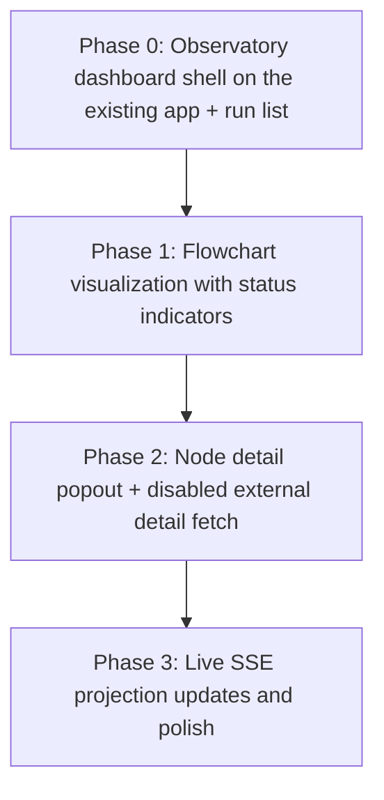
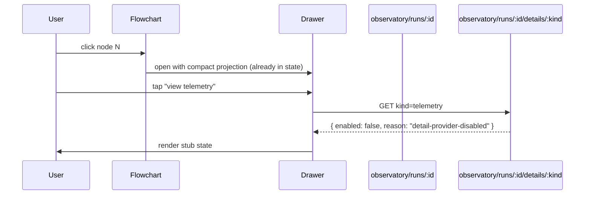

# ecogenie-ai-observatory Implementation Plan

The dashboard for the Agent Run Observatory MVP: a Next.js 16 + React 19 + TypeScript + Tailwind app that shows a workflow-like view of one selected agent run at a time. It is **API-only**: every datum it shows comes from the backend's HTTP or SSE endpoints. No direct database access, no spec-file parsing, no client-side reconciliation. The backend (in the `ecogenie-backend-ai-agent` repo) owns projection storage, planned-graph derivation, reconciliation, and the API/SSE surface — see that repo's `docs/implementation-plan.md` for the contract this UI consumes. The Next.js scaffold, the `src/lib/agent-api.ts` client, the `/api/agent/...` server-side proxy, and the existing `AgentConsole` placeholder are already in place; this plan layers the observatory dashboard on top.

## Phase Flow

## Phase Status
| Phase | Status |
|---|---|
| Phase 0 | completed |
| Phase 1 | current |
| Phase 2 | pending |
| Phase 3 | pending |

## Recommended Execution Order
1. Phase 0 — Observatory dashboard shell on the existing app + run list
2. Phase 1 — Flowchart visualization with status indicators
3. Phase 2 — Node detail popout + disabled external detail fetch
4. Phase 3 — Live SSE projection updates and polish

## Automation Contract
- **Stack (already scaffolded in this repo)**: Next.js 16 (App Router, `src/` directory layout), React 19, TypeScript 6, Tailwind 4, ESLint 10, `lucide-react` icons.
- **Important — Next.js 16 caveats**: per `AGENTS.md` at the repo root, this Next.js has breaking changes from earlier versions. Implementers must consult `node_modules/next/dist/docs/` before writing new code.
- **Gates** (run from this repo's root): `npm run lint` is the static-quality gate. `npm test` (Jest + React Testing Library) is added by Phase 0 — once added it is the test gate. Implementers run only lint; reviewers run lint + tests.
- **New dependencies introduced by this plan**: Phase 0 — `jest`, `@testing-library/react`, `@testing-library/jest-dom`, `jest-environment-jsdom`, `ts-jest`. Phase 1 — `@xyflow/react` (ReactFlow). No other new deps unless a phase's Work block names one.
- **Backend contract.** The complete observatory HTTP + SSE surface is defined in [`ecogenie-backend-ai-agent/docs/implementation-plan.md`](../../ecogenie-backend-ai-agent/docs/implementation-plan.md). The browser connects only through the Next.js proxy routes added by Phase 0.
- **No back doors**: the UI must not read MongoDB, parse spec JSON, or run a reconciler.
- **Scope**: internal-only; no auth flows beyond `sourceKey` propagation; not deployed.

## Definition of Done
- The dashboard renders on the existing app shell's `Overview` route: full-width flowchart main column with a collapsible right-docked sidebar.
- The run list is driven by the backend run-index endpoint; selecting a run renders its full-width, vertically scrolling flowchart.
- Every node shows the correct status colour using the live graph the backend returns.
- Adjusting the threshold control causes an API re-fetch with the new `threshold` value.
- Clicking a node opens the overlay detail drawer with the compact projection fields.
- The graph updates live for in-progress runs via the existing SSE stream.
- `npm run lint` clean and `npm test` green.

## Phase 0: Observatory dashboard shell on the existing app + run list
Status: completed

Layer the observatory dashboard onto the already-scaffolded Next.js app: turn the placeholder `Overview` route into the observatory home, add the right-docked filter sidebar, wire the backend client, and stand up the test framework.

### Work
- [w1] Stand up the test framework: add Jest + React Testing Library + jsdom; add a `test` script in `package.json`; commit at least one passing smoke test.
- [w2] Replace the placeholder body of `src/app/page.tsx` with the observatory dashboard: full-width main column for the flowchart placeholder; collapsible right-docked sidebar with filters, threshold control (default 5), and run list.
- [w3] Add an observatory backend client at `src/lib/observatory-api.ts`: typed wrappers for `getRuns`, `getRun`, `streamRun`.
- [w4] Extend the existing server-side proxy with observatory routes under `src/app/api/observatory/runs/route.ts` and `src/app/api/observatory/runs/[runId]/route.ts`.
- [w5] Bind the filter sidebar + run list to the run-index endpoint; filter + selected-run state reflected in the URL.
- [w6] Selecting a run calls the single-run endpoint with the current threshold and stores the reconciled live graph in component state.
- [w7] Until backend Phase 4 is available, keep Phase 0 network tests contract-mocked and render clear backend-unavailable states.
- [w8] Define the five status colour tokens once in `src/lib/status-tokens.ts`.

### Acceptance Criteria
- [a1] `npm run lint` clean; `npm test` runs with at least one passing smoke test.
- [a2] The home (`Overview`) route renders the observatory shell with left nav preserved, full-width flowchart placeholder, docked collapsible right sidebar with filters + threshold + run list.
- [a3] Changing any filter re-queries the run index; filter + selected-run state survive reload via the URL.
- [a4] Selecting a run calls the single-run endpoint with the current threshold and stores the reconciled live graph in state.
- [a5] Adjusting the threshold control re-fetches the single-run endpoint with the new `threshold` value.
- [a6] The status colour tokens are defined in exactly one place and consumed by reference.
- [a7] The observatory proxy routes round-trip the documented contract (returning the backend's bodies unchanged).

## Phase 1: Flowchart visualization with status indicators
Status: current

Render the backend-returned reconciled live graph with ReactFlow as the vertically scrolling flowchart.

### Work
- [w1] Add `@xyflow/react` (ReactFlow) as a runtime dependency.
- [w2] Render the graph with ReactFlow top-to-bottom, full width, growing downward with vertical scroll for large runs.
- [w3] Colour every node by the status field the backend already populated, using the Phase 0 tokens; visually distinguish `nodeType` and mark unplanned/conditional elements via flags carried on the backend's nodes.
- [w4] Render aggregate nodes (the backend collapses these per threshold) distinctly with a count badge; render a persistent legend.
- [w5] Apply a node-count budget: when the rendered graph exceeds the budget, aggregate nodes start auto-collapsed and subtrees lazy-expand on demand.
- [w6] Keep layout stable across incremental mutations (a status change must not reshuffle the whole diagram).

### Acceptance Criteria
- [a1] A large run renders as a full-width vertically scrolling flowchart (scrolls rather than shrink-to-fit).
- [a2] A run exceeding the node-count budget renders with the backend's aggregate nodes auto-collapsed and stays interactive.
- [a3] A mixed run shows the planned/done/running/warning/error colours simultaneously and correctly; legend is present and accurate.
- [a4] Aggregate nodes are visually distinct and show the count the backend supplied; node types are distinguishable.
- [a5] An incremental status update recolours only affected node(s) without a full re-layout jump.

## Phase 2: Node detail popout + disabled external detail fetch
Status: pending

Clicking a node reveals the compact operational detail the backend already returned for it and makes the disabled/stubbed external-detail state explicit.

### Work
- [w1] Make nodes selectable; selecting opens a dismissable overlay detail drawer and highlights the node in the graph.
- [w2] Render in the drawer the compact projection fields the backend already returned for that node: identity, status, start/end/duration, parent/children, attempt count, instance count, warning/error class, short sanitized message, counters, and `detailRef` availability.
- [w3] For an aggregate node, expansion opens a modal listing the compact summary instances the backend returned when present; otherwise it shows the aggregate count and a disabled-detail message.
- [w4] Stub telemetry/log/blob fetches call `GET /agent-api/v1/observatory/runs/:runId/details/:kind` and render its disabled payload cleanly.
- [w5] Drawer/modal are keyboard-dismissable; selection state reflected in the URL for deep links.

### Acceptance Criteria
- [a1] Clicking a node opens the drawer with matching compact projection data; clicking another swaps content; dismissing restores the full-width graph.
- [a2] Timing/status/counter/error summary shown in the drawer matches the compact projection the backend returned for that node.
- [a3] Disabled telemetry/log/blob details render the exact disabled payload as a clear stub state, not an error or blank panel.
- [a4] An aggregate node expands to a modal showing the backend-supplied compact summary instances when present or a disabled-detail message when not.
- [a5] A deep link with a selected run + node restores run, graph, and open drawer on load.

## Phase 3: Live SSE projection updates and polish
Status: pending

Make it a live operational snapshot for in-progress runs over the existing SSE stream, and harden.

### Work
- [w1] Subscribe the selected run to the existing SSE stream proxied through `src/app/api/observatory/stream/`. Apply incoming reconciled node-level update events directly to the live graph in state.
- [w2] Show a run-level "live" indicator; auto-follow newest activity with an opt-out to pin scroll.
- [w3] Handle SSE disconnect/reconnect with backfill via a single-run endpoint re-fetch at the current threshold; do not duplicate nodes.
- [w4] Performance pass for large/long runs via the Phase 1 node-count budget; empty/error states (no runs match, run has no projection yet, stream unavailable → degrade to periodic single-run polling).

### Acceptance Criteria
- [a1] A run started with the dashboard open transitions nodes planned→running→done/warning/error live without manual refresh, driven entirely by SSE events.
- [a2] SSE drop/restore re-syncs by single-run re-fetch to the correct compact final graph with no duplicate or lost nodes.
- [a3] A large live run stays interactive (scroll, select) within an acceptable frame budget.
- [a4] Each empty/error state renders a clear, correct UI rather than a blank or broken canvas.

## Files to Create or Modify by Phase
### Phase 0
- [f1] `package.json` — add Jest + RTL devDependencies and a `test` script
- [f2] `jest.config.ts` + `jest.setup.ts`
- [f3] `src/app/page.tsx` — replace placeholder body with the observatory shell
- [f4] `src/components/observatory/FilterRunSidebar.tsx` — filters + threshold control + run list
- [f5] `src/components/observatory/EmptyCanvas.tsx` — explicit empty state when no run is selected
- [f6] `src/lib/observatory-api.ts` — typed observatory client
- [f7] `src/lib/observatory-types.ts` — TypeScript types mirroring the backend contract
- [f8] `src/lib/status-tokens.ts` — five status colour tokens
- [f9] `src/app/api/observatory/runs/route.ts` — server-side proxy for run-index
- [f10] `src/app/api/observatory/runs/[runId]/route.ts` — server-side proxy for single-run
- [f11] `src/app/api/observatory/stream/[runId]/route.ts` — server-side proxy for SSE
- [f12] `__tests__/observatory-api.test.ts`, `__tests__/FilterRunSidebar.test.tsx`, `__tests__/proxy-routes.test.ts`
- [f13] `README.md` — extend to cover how to run the dashboard

### Phase 1
- [f1] `package.json` — add `@xyflow/react` runtime dependency
- [f2] `src/components/observatory/Flowchart.tsx` — ReactFlow render + colouring + legend + node-count budget
- [f3] `src/components/observatory/AggregateNode.tsx` — aggregate node renderer
- [f4] `__tests__/Flowchart.test.tsx`
- [f5] `__tests__/AggregateNode.test.tsx`

### Phase 2
- [f1] `src/components/observatory/NodeDetailDrawer.tsx` — overlay detail drawer
- [f2] `src/components/observatory/InstanceModal.tsx` — aggregate summary-instance modal
- [f3] `__tests__/NodeDetailDrawer.test.tsx`
- [f4] `__tests__/InstanceModal.test.tsx`

### Phase 3
- [f1] `src/lib/live-stream.ts` — SSE subscription + reconnect/backfill + auto-follow
- [f2] `__tests__/live-stream.test.ts`

## Test Plan
### Phase 0
- Test framework runs at least one smoke test; `observatory-api` calls the right URLs with the right headers (fetch mocked); proxy routes round-trip the backend contract; filter change re-queries the run index; selecting a run calls the single-run endpoint with the current threshold; threshold change re-fetches; URL round-trips filter + selected-run state; status tokens defined once.

### Phase 1
- Backend-supplied mixed-status live graph maps all five colours correctly; aggregate nodes render with the backend-supplied count; legend accurate; large run scrolls full-width without shrink-to-fit; a run over the node-count budget renders with aggregates auto-collapsed and a subtree lazy-expands on demand without re-aggregating; incremental recolour does not trigger a full re-layout.

### Phase 2
- Node click opens drawer with matching backend-supplied compact data; switching swaps; dismiss restores full-width without disturbing the sidebar; disabled telemetry/log/blob fields render the stub state; aggregate-node expansion opens the instance modal; deep link restores run + graph + drawer.

### Phase 3
- Live run transitions colours without refresh over SSE; SSE drop/restore re-syncs via single-run re-fetch with no duplicate or lost nodes; a large live run stays interactive; each empty/error state renders correctly.

## Decisions
- **UI is API-only.** No direct database access, no spec-file parsing, no client-side reconciliation. The only contract surface is the backend's Phase 4 HTTP + SSE endpoints in `ecogenie-backend-ai-agent`.
- **Contract is defined in the backend plan; this plan references it.** Endpoints, query parameters, payload shapes, defaults, and the disabled-detail response shape live in the backend plan. This plan does not restate them.
- **Backend reconciles; UI renders.** The single-run endpoint returns an already-reconciled live graph. SSE events are reconciled node updates. The UI applies events directly to in-memory state without recomputing status or aggregation.
- **Threshold via query parameter; re-fetch on change.** Default 5. Changing the threshold triggers a single-run endpoint re-fetch with the new value.
- **Aggregation is display-only on the client.** The backend decides which nodes are aggregates and how many they represent; the UI chooses only whether to render them expanded or collapsed.
- **Status colour palette has five tokens.** `planned` = neutral/gray; `done` = green; `running` = purple; `warning` = amber; `error` = red. Defined once in `src/lib/status-tokens.ts`.
- **Layout.** The diagram always shows exactly one agent workflow. The existing left nav sidebar is preserved as the app shell. The observatory adds a right-docked collapsible sidebar containing filters/threshold and the run list. The node-detail view is a separate dismissable overlay drawer.
- **Server-side proxy.** Browser → backend calls go through Next.js route handlers under `src/app/api/observatory/`.
- **Backend Phase 4 gates real dashboard acceptance.** UI Phase 0 can build the shell, typed client, proxy routes, and mocked contract tests before backend Phase 4 lands.
- **Repo separation.** This is the production-facing repo for the observatory dashboard. The backend lives in `ecogenie-backend-ai-agent`. The two are coupled only through the documented HTTP + SSE contract.
- **Disabled detail is a valid UI state.** Until telemetry/log/blob stores exist, detail affordances call the disabled detail-provider endpoint and render its disabled payload cleanly.
- **Document-driven contract accepted for MVP.** The exact shared contract shape is document-driven rather than enforced by OpenAPI, codegen, or shared types.
- **Next.js 16 is the chosen runtime, intentionally.** Per the repo's `AGENTS.md`, App-Router, route-handler, and config conventions have shifted from earlier versions.
- **Test framework: Jest + React Testing Library.** No end-to-end framework in scope.
- **The existing `AgentConsole` placeholder is unrelated to the observatory.** It can stay in the repo as a separate utility component.

## Open Questions

_(none — telemetry/log/blob architecture is intentionally stubbed and deferred, not blocking this MVP.)_

## Residual Risks
- **Backend↔UI contract drift (accepted, post-MVP).** No shared type system; the UI mirrors the backend contract in `observatory-types.ts` and can drift silently.
- **Stubbed detail surfaces limit usefulness.** Telemetry/log/blob drill-downs are disabled until those stores are selected in the backend plan.
- **Two-repo local dev**: running the dashboard requires both `ecogenie-backend-ai-agent` (backend) and this repo (dashboard) running locally with matching ports.
- **Next.js 16 unfamiliarity.** The chosen runtime has breaking changes from the version in most training data.
